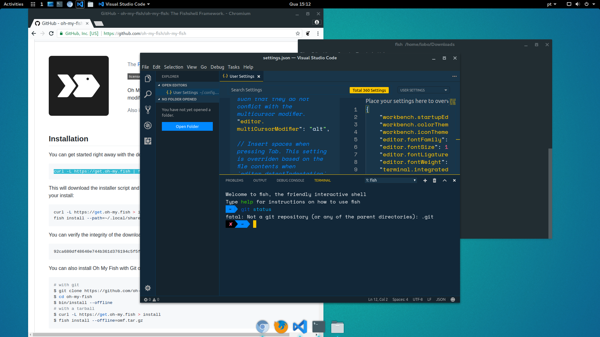
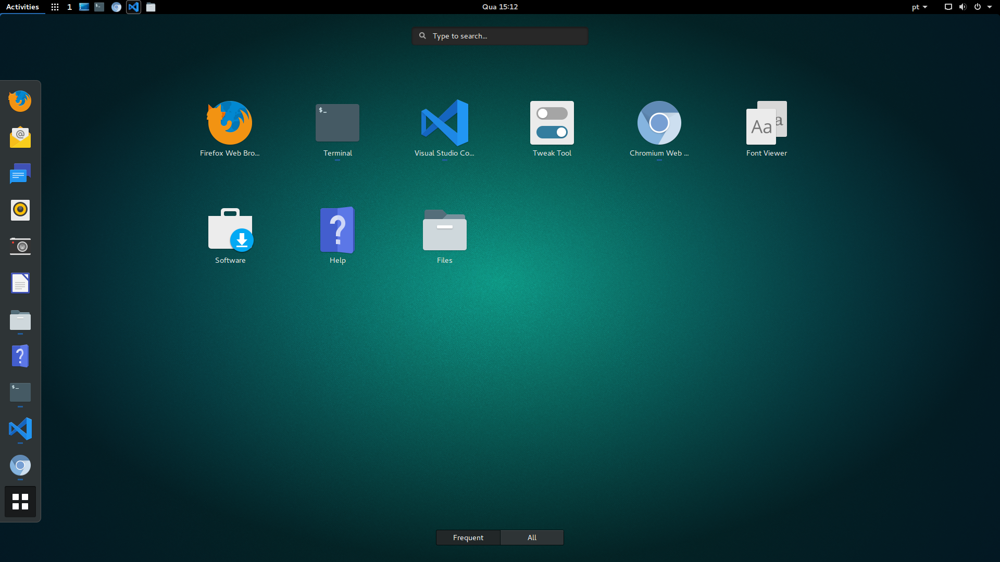
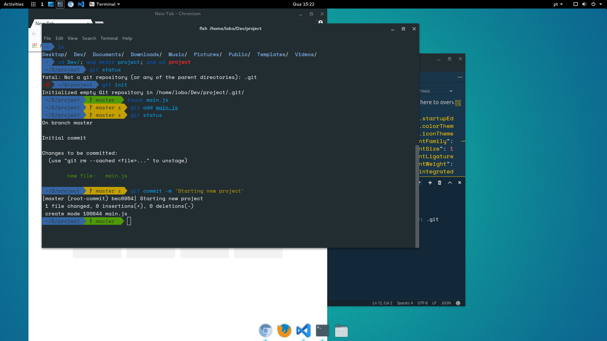

# my-desktop-setup
Config for my desktop(s) eye candy setup 😛 // Configuração para o visual bonitinho do meu desktop 😛

[English] / [Portuguese soon(-ish?)]





## Preamble

I spend a good ammount of my time programming (8+ hours, Monday to Friday) with an Ubuntu Linux workstation since 2012. I had to find a setup that I thought it was nice to look and reduced eyestrain as much as possible.

The first step was to find an editor that I could use for a long time, without too much distraction, a light and fast one, but powerful enough that I hadn't to rely in many other tools to get the job done. IDEs (as Eclipse and NetBeans) were quite powerful, but took quite a long time to initialize and had a lot of visual pollution. So, I passed to the 'lightweight' editors: Sublime Text, Atom and Visual Studio Code. Each of them had its strengths, but I settled for the VSCode mostly for one reason: integrated terminal from start. That and its continuous development, nice extension support, good and functional interface, and relative maturity took me to adopt it as my editor.

Besides the functional extensions, I looked for a theme that were nice to look for an entire day. Went through some nice Material-based themes and icons. But really liked [Wes Bos](https://wesbos.com)' Cobalt2 theme for Sublime, that he uses in his video courses. And - surprise, surprise! - now there is a [Cobalt2 for VSCode](https://github.com/wesbos/cobalt2-vscode) too (Thanks, Wes!)! Besides, I adopted the [fish shell](https://fishshell.com) with a few gimmicks, namely the [Oh My Fish](https://github.com/oh-my-fish/oh-my-fish) framework and the agnoster theme; and also the Space Mono font, patched by [Nerd Fonts](https://nerdfonts.com) to comply with the powershell-like terminal decoration.

Meanwhile, I tested a lot of variations for the Ubuntu desktop (Unity, Kubuntu, Lubuntu, Mate). In the end, I settled down using the Gnome shell, plus [Adapta GTK theme](https://github.com/adapta-project/adapta-gtk-theme/) and [Paper Icons](https://snwh.org/paper) by [Sam Hewitt](https://samuelhewitt.com/)

This is mostly a reminder to myself of what steps I have to do in case I have to reconfigure my desktop. If you got interested and want to try some/all of my custom setup, be my guest!

## Config Steps
### OS
You will need to install an [Ubuntu](https://www.ubuntu.com/) Desktop distro. If you have the [Gnome Desktop](https://ubuntugnome.org/) one, jump for the next step. If not, you can install the Gnome shell using `sudo apt install gnome-shell`. Log out, and choose the Gnome desktop for your user in the login screen.

Install also the Gnome Tweak Tool (if not installed) to choose theme and icons that you will install next: `sudo apt install gnome-tweak-tool`

#### Theme
##### Adapta GTK installation
You will need to add the repository to your system sources list before installing it:

```
sudo add-apt-repository ppa:tista/adapta
sudo apt update
sudo apt install adapta-gtk-theme
```

##### Paper Icons
Similarly, you will have to add the Paper Project repo:

```
sudo add-apt-repository ppa:snwh/pulp
sudo apt update
sudo apt install paper-icon-theme
```

##### Activating all
Open the Gnome Tweak Tool from the Applications list or from the terminal with the command `gnome-tweak-tool`. In the tab *Appearance*, choose *Adapta* (or variants) from the GTK+ dropdown, and *Paper* from the *Icons* one. Done, you are themed

#### Fish + Oh My Fish
Fish is a shell that supports a few nice helpers, like history suggestion. The Oh My Fish is a framework that allows extending fish functionalities and adding themes, like the agnoster one that I chose.

It will require that you have git and curl installed (`sudo apt install git curl`).

To install Fish and set it as default shell:

```
sudo apt-get install fish
chsh -s /usr/bin/fish
```

You may have to log out and in again to see the changes.

Then, you can install the Oh My Fish framework and the agnoster theme:

```
curl -L https://get.oh-my.fish | fish # if you don't have curl installed, sudo apt install curl

# Install agnoster
omf install agnoster

# If the theme is not activated right away
omf theme agnoster

```

#### Space Mono patched
The Space Mono is a quite pretty font available at Google Fonts. To use with the agnoster theme in the terminal, it is interesting to select the Nerd Fonts patched version, which includes glyphs to decorate the command line and to use in your daily tasks with fonts, glyphs and icons. The font is available at the [Nerd Fonts site](nerdfonts.com) or at the [GitHub repo](https://github.com/ryanoasis/nerd-fonts/tree/master/patched-fonts/SpaceMono/complete). Download and install it accordingly (usually, double-click the `Space Mono Nerd Font Complete Mono.ttf` file and click the *Install* button on the font visualizer). Now that the font is available system-wide, select it in your desired applications.

#### Other visual treats
I also use Plank as a dock (`sudo apt install plank` and set it as Startup Application), Peter Levi's [Variety](http://peterlevi.com/variety/) wallpaper changer, and TaskBar from (https://extensions.gnome.org)

### Visual Studio Code
You may get the VSCode from its official site: https://code.visualstudio.com/

#### Cobalt2 Theme
In the *Extensions* tab, look for *Cobalt2 Theme Official*, by Wes Bos. Install and reload when asked. Then, go to *File* > *Preferences* > *Color Theme (Ctrl+K Ctrl+T)* and choose `Cobalt2`.

#### Material Icon Theme
In the *Extensions* tab, look for *Material Icon Theme*, by Philipp Kief. Install and reload when asked. Then, go to *File* > *Preferences* > *File Icon Theme* and choose `Material Icon Theme`.

#### More settings (fonts and terminal)
Go to *File* > *Preferences* > *Settings (Ctrl+,)*. In the right side, you will be able to edit your configs in JSON format. Add the following key/value pairs to the ones already there:

```javascript
{
  "editor.fontFamily": "'SpaceMono Nerd Font Mono', 'Courier New', monospace",
  "editor.fontLigatures": true,
  "editor.fontSize": 18,
  "editor.fontWeight": "normal",
  "editor.lineHeight": 22,
  "terminal.integrated.fontLigatures": true,
  "terminal.integrated.fontSize": 16,
  "terminal.integrated.lineHeight": 1.5,
  "workbench.colorTheme": "Cobalt2",
  "workbench.iconTheme": "material-icon-theme"
}
```

## Thanks
I'd like to really thank the developers who took some of their time to help the community and provide so many nice tools/themes/tips. Really appreciate it!

## Goodbye!
Hope you can find some usefulness in this setup! If you want to give a hello, shout out, my Twitter is [@ManoelTLobo](https://www.twitter.com/ManoelTLobo). See you!